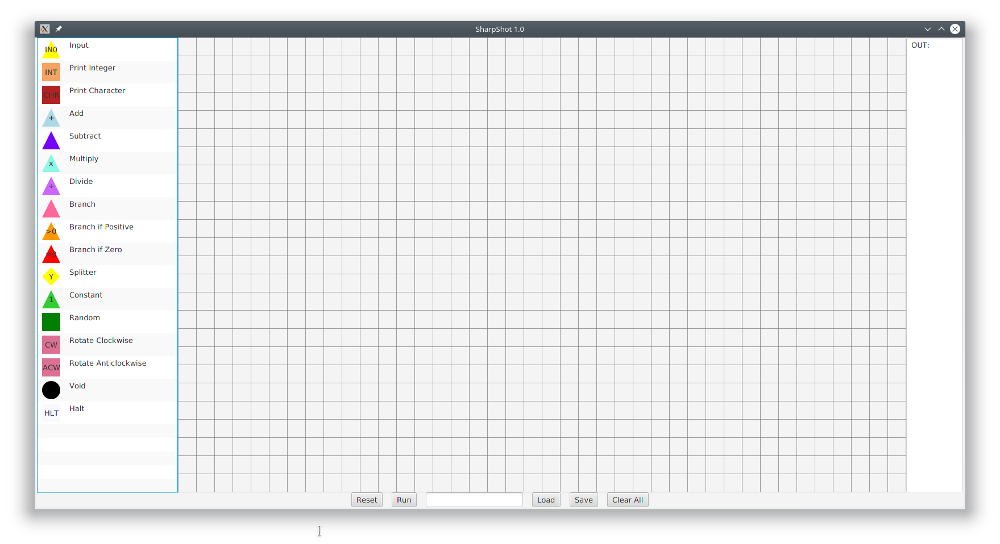
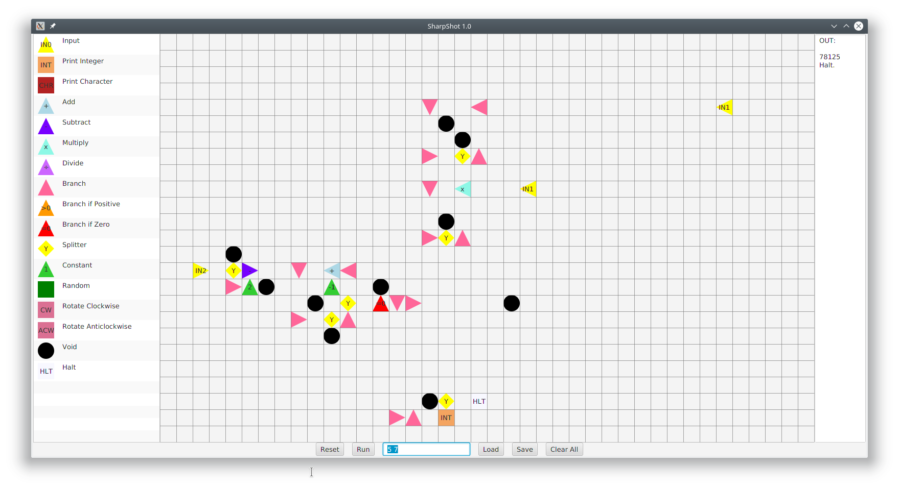

# sharpshot

An esoteric visual programming language developed by Steven Lowes, James Chalk, and Ivan Donat Pupovac.
Name is a reference to C# and shot, as in bullets being shot.
Put Nodes on a two-dimensional grid to represent constants, branching and conditionals, whereas integers being shot and moved around are the arguments.

Node types include IO, Arithmetic, Branching, Conditionals, Stacks/Lists and Random

# Images

