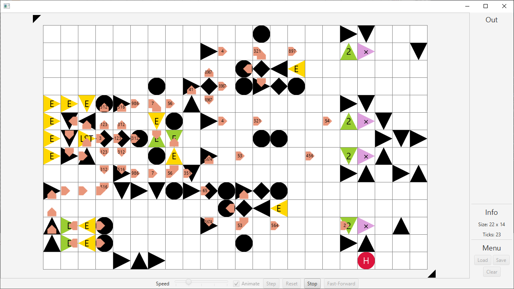

# SharpShot

A ZachLike puzzle game based on an underlying esoteric visual programming language.
SharpShot v0.1 was created for Durhack 2018 by Steven Waterman, James Chalk, and Ivan Donat Pupovac.

**Nodes** are placed on the 2D grid known as a **Board**.
They and perform functions on **Bullets** which carry data around the board.
When bullets collide, they annhilate each other.

Read the dev blog at [StevenWaterman.uk](http://www.stevenwaterman.uk/tags/#SharpShot)

# Images
Given an arbitrary number of inputs, this board multiplies all inputs except the first by the first input. It is optimised for speed, and takes 1 tick per input by splitting the inputs into 4 parallel streams, performing the multiplication, then recombining the streams in order.

